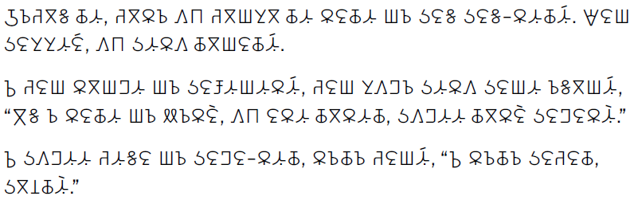

The Kedebideri font supports the Beria Erfe script which is used for the Zaghawa Beria language of Sudan and Chad.

This font was initially designed by a volunteer who chooses to remain anonymous, in cooperation with SIL Global and the Mission Protestante Franco-Suisse au Tchad.

The Latin glyphs were imported from Source Sans Pro at 103% and a weight of CSS 360.

One font from this typeface family is included in the *Kedebideri* release:

* Kedebideri Regular

## Type Samples

Type samples showing some of the inventory of glyphs can be found here: 
[Kedebideri Type Sample](sample.md).

One example of some text is shown below. 

{.fullsize}
<!-- PRODUCT SITE IMAGE SRC https://software.sil.org/kedebideri/wp-content/uploads/sites/73/2024/09/milkseller.png -->
<figcaption>Kedebideri Sample</figcaption>